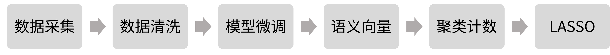

# 从舆情到流水：基于评论语义分析的《崩坏：星穹铁道》流水预测

完整版见[基于评论语义分析的《崩坏：星穹铁道》流水预测](基于评论语义分析的崩铁流水预测.md)或[知乎专栏](https://zhuanlan.zhihu.com/p/1984400186538221769)。

## 概要
本项目旨在使用卡池开放前的视频评论预测卡池流水，以期为调整宣发和资源投放提供参考。先采集《崩坏：星穹铁道》的角色相关视频评论，微调BERT模型并进行语义聚类构造特征，最终使用LASSO预测流水。
结果表明：
- 相比仅使用评论总数的基线模型，引入语义聚类特征后，交叉验证预测误差从33%降低到21%，模型可解释方差高达R²=80%。
- 攻略测评中关于强度焦虑和资源配置的讨论热度是预测流水的核心因素。

这说明评论区中确实隐含了玩家的付费意愿，且可以通过语义分析转化为可用的、可监控的业务信号可提取的特征。

## 方法
### 研究对象
本项目以《崩坏：星穹铁道》为研究对象，每个角色卡池视为一个观测点。因变量为角色的七麦7日iOS流水，自变量为角色PV、走近星穹、头部攻略UP测评的发布24小时内视频评论。

## 项目结构
* `preprocess.ipynb`: 数据处理流水线。整合七麦流水与B站视频数据，爬取评论，并进行针对表情及黑话进行文本清洗。
* `fine_tuning.py`: 语义模型微调脚本。基于 bert-base-chinese，依次执行 MLM、TSDAE、SimCSE 三阶段无监督训练，适配游戏社区语境。
* `final_analysis.ipynb`: 核心分析与建模。执行语义向量化、球面 K-means 聚类、LASSO 回归建模及稳健性检验，并输出特征归因分析。

## 结果
### 模型预测效果
基线模型使用时间、卡池位置、角色性别三个控制变量以及三个视频的评论总数作为自变量，预测误差为33%，R²为0.63。
引入基于微调后语义向量的聚类话题特征之后，模型预测误差降低至21%，R²为0.80，相比于基线降低了33%的预测误差。

### 稳健性检验
为了说明结果的稳健性，在语义空间随机选取中心进行聚类。微调模型的随机中心表现显著优于基座模型，证明微调改善了与流水相关的语义结构。最佳模型的表现显著优于随机中心，证明K-means从语义空间提取的话题对预测流水有效。

### 解释性洞见
LASSO筛选出的聚类高度集中在攻略测评下的角色强度评价、资源分配以及抽卡计划相关讨论。这些话题的讨论热度与后续流水高度相关，表明核心玩家的强度焦虑和抽卡性价比讨论是付费的最直接信号。

官方的PV和走近星穹下的评论对流水的预测能力不佳或被强度评论吸收。这表明单纯的情绪和热度可能对短期的流水贡献有限。

## 局限性与下一步
- 数据与规模：七麦流水并非真实流水，只是带噪声的代理变量。并且分析的样本量有限，只有22名角色，即使使用交叉验证，模型选择也必然高估预测表现。
- 信息泄漏：模型微调和语义聚类都使用了全量数据(尽管是无监督的)，存在潜在的信息泄漏。
- 泛化：模型难以外推到其他角色/游戏，需要重新微调。

未来考虑引入更多游戏的数据以进行泛化，并进行真正的无泄漏预测验证。此外，还可以使用更复杂的核方法或更灵活的方法来找到更有预测力的聚类。

