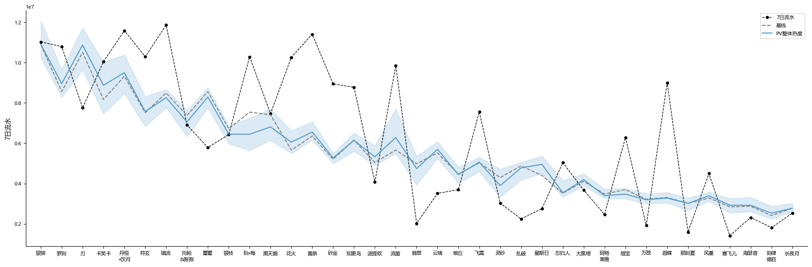
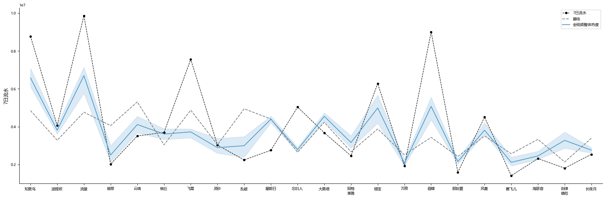
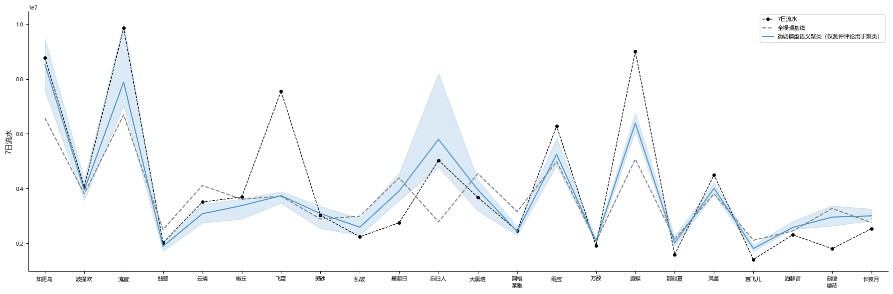

# 0. 摘要
本项目旨在通过《崩坏：星穹铁道》角色相关视频的评论内容来预测角色卡池的流水。我们使用PV、走近星穹及头部攻略UP主的视频评论，对SBERT模型进行微调。随后将上述评论转化为语义向量，通过球面K-means聚类提取话题特征，使用LASSO回归建立预测模型。
结果显示，相比于仅使用评论总数的基线模型，引入语义聚类特征的模型的交叉验证预测误差降低了33%，能够解释高达80%的方差。攻略测评中关于强度和抽卡的讨论热度是预测流水的核心因素。这表明评论区中确实隐含了玩家的付费意愿，且通过语义分析可以有效挖掘这些信息。

# 1. 引言
本项目源自某天突发奇想。有没有可能用角色相关视频的评论来预测角色的流水呢？直觉上，这应该是可以做到的，因为每条评论可以看成语义空间的一个向量，视频的评论相当于不定数量的高维向量。为了使其变为可处理的固定数量自变量，我们只需要在语义空间或者降维的语义空间中聚类，统计每个类的评论数量，就可以转化为聚类数量的自变量。并且这些自变量本身也可以通过概括聚类内评论的语义来贴上标签。
不过，评论中不可能包含能预测流水的所有信息，因此预测不可能非常准确。这种方式的核心思路是通过聚类尝试从评论中发掘能够预测流水的因素，也即注重可解释性而非预测精确程度。

仔细思考了一阵子并向GPT确认，发现现成的BERTopic算法就能对语义向量聚类并归纳语义信息(尽管我们后来抛弃了这个现成的工作流，自己进行分析)。果然这是可行的，开干！反正不会的代码就让GPT写，不会的分析就问GPT怎么做！  

# 2. 研究对象与数据
在第2和第3章中，我们简要过一下使用的方法，以免被大段的方法解释打断阅读体验。更具体的细节和心路历程参见第6章。
## 2.1 研究对象
我们以《崩坏：星穹铁道》为研究对象，每个角色卡池视为一个观测点。每个观测点的数据包括其对应卡池的流水和角色相关视频的评论区。

## 2.2 流水数据（因变量）
我们从七麦抓取了崩铁在iOS端的日流水数据，并按卡池时间轴拆分到每个角色池。对每个角色池，仅取7日流水用于分析。不考虑复刻池的影响。

删除了以下6个不方便分析的角色数据：
- 开服的希儿和景元
- 免费的真理医生和丹恒·腾荒
- 卡池时间与众不同的白厄和Saber
  
从1.1版本的银狼到3.6版本的长夜月，共将37个角色的7日流水纳入分析，作为后续所有预测模型的因变量基础。

## 2.3 评论数据（自变量原始语料）
我们使用爬虫爬取了每名角色的以下三种视频的评论作为语料，并进行了基础的清洗：
- 角色PV(下文简称PV)
- 走近星穹
- 卡特亚的测评(下文简称测评)

分析时，仅使用发布后24h内的评论以对齐时间并防止信息泄漏。对于知更鸟之前的角色，走近星穹和测评的发布时间都晚于卡池开放，因此这两类视频的评论视为缺失。
后续的语义分析只使用从知更鸟开始、三种视频都有合规评论数据的22名角色。仅在基线分析中只使用PV的数据对全部37名角色进行分析。

## 2.4 目标与目的
我们的研究目标是使用每名角色的三种视频的24h内评论，对角色卡池的七麦iOS7日流水进行预测；我们希望能从预测中发掘并解释能够预测流水的因素。

# 3. 分析框架
## 3.1 语义表征与微调
使用`bert-base-chinese`作为基座模型将清洗后的评论从自然语言转换为语义向量用于分析。

考虑到评论中充斥着模型没见过的梗和黑话，我们通过领域微调来提升语义向量的质量。依次进行MLM、TSDAE和SimCSE三个无监督任务，在全部评论语料上对基座模型进行训练，使模型更贴近评论语境。我们后续会比较基座模型和微调模型生成的语义向量的预测效果，以检验微调带来的提升。

## 3.2 K-means聚类与特征构造
一个视频的评论区对应着不定数量的语义向量，无法直接作为回归模型的输入。我们采用聚类的方式，将其转化为固定数量的自变量。

我们使用球面K-means算法对语义向量进行聚类，得到 $ K $ 个聚类质心。这些质心可以理解为 $ K $ 个不同的话题中心。随后，对于每个视频，我们将其24h内的所有评论分配到语义空间中最近的质心(即Voronoi分割)，再统计落入每个聚类的评论数量，从而将评论区转化为 $ K $ 个聚类的讨论热度，作为特征用于回归。
由于不同的 $ K $ 对应的话题中心也不同，我们搜索 $ K=1,2,3,\dots,50 $ ，寻找最有预测力的话题划分。 $ K=1 $ 时本质上只统计评论总数，是无需聚类也无关语义的基线条件。

## 3.3 预测目标与变量
对于每个角色卡池，我们构建以下变量：
- 因变量 $ y $ ：7日流水的对数
- 自变量 $ X $ ：
  - 3个控制变量：卡池距离开服的时间、是否是下半池、是否是男性
  - 3 $ K $ 个评论特征：PV、走近星穹、测评三个视频，在 $ K $ 个聚类上各自的聚类评论数的对数(即讨论热度)

在没有缺失值的情况下，共有3 $ K $ +3个自变量。7日流水和聚类评论数通常是长尾分布，因此在分析前先取对数。所有自变量和因变量在回归时都被标准化，以便比较系数。

## 3.4 LASSO回归与模型选择
由于自变量太多，我们采用LASSO回归，通过L1正则化从过量的特征中筛选出少数有预测力的特征。

模型的预测表现通过重复K-fold交叉验证进行评估，以out-of-fold预测的平均绝对误差(MAE)为核心比较指标。由于流水取对数，这实际上是预测的百分比误差。为了得到更容易解释的有力预测特征，我们强制所有模型使用一个较大的共享 $ \alpha=0.15 $ ，以压缩特征数量，降低过拟合倾向。
通过模型比较，我们寻找表现最佳的模型及其对应的 $ K $ 个话题中心。

## 3.5 聚类含义解释
在找到有预测能力的聚类后，我们通过c-TF-IDF抽取聚类的代表性关键词，并查看中心的最近邻评论作为该聚类话题的典型范例。

## 3.6 稳健性检验
为了确保我们观察到的规律是真实存在的，而非分析方法或数据随机性产生的偶然结果，我们设计了多组检验：
- 配对t test：检验两个模型在每个观测点的绝对预测误差是否存在差异。
- Permutation Test：通过打乱标签生成零分布，检验不同条件下模型表现分布的差异。
- 随机聚类的蒙特卡罗检验：将评论随机划分为 $ K $ 类，检验多次重复中最佳模型的表现分布，以确认语义信息本身是有价值的。
- 随机中心的蒙特卡罗检验：在语义空间中随机生成 $ K $ 个中心进行Voronoi分割，检验多次重复中最佳模型的表现分布，用以评估K-means找到的质心是否比随机方向更有效。

***
# 4.结果
结果部分我们主要分析并比较了4个模型。为了方便理解和内容整洁，先给出4个模型的编号及自变量：
|编号|自变量|
|----|----|
|Model 0 (控制)|仅使用控制变量|
|Model 1 (基线)|使用控制变量及 $ K=1 $ 的评论总数|
|Model 2 (基座聚类)|根据基座模型对评论聚类， 使用控制变量及聚类评论数得到的最佳模型|
|Model 3 (微调聚类)|根据微调模型仅对测评评论聚类得到质心， 随后进行Voronoi分割得到聚类， 使用控制变量及聚类评论数得到的最佳模型|

## 4.1 基线分析：不使用语义向量的预测能力
我们先建立基线模型作为后续比较的基础。最简单的基线模型(记为Model 0)只使用3个与视频无关的控制变量：时间、上下半池、性别。在此基础上，取 $ K=1 $ 将评论聚成1类，把24h内的评论总数作为额外自变量，考察其对预测能力的提升。
我们先仅将PV纳入分析，因为所有角色PV都发布早于卡池，有合规评论数据。在3个控制变量的基线上，考虑PV的24h评论数对流水的影响。如前所述进行LASSO回归交叉验证，结果如图1。

图1. 使用控制变量和PV评论总数拟合的结果。黑色虚线为真实流水，灰色虚线为仅使用控制变量的Model 0，蓝色实线为使用控制变量加上PV评论总数拟合的结果，浅蓝色阴影为其10次重复的最大到最小值范围。从左向右按时间排序。

如图1所示，参考基线条件Model 0，PV评论总数对流水的预测力可以说没有。Model 0的平均MAE为 $ 0.38(SD=0.01) $ ，相当于平均46\%的预测误差，平均 $ R^2=0.55(SD=0.01) $ ；加入PV评论总数后的平均MAE为 $ 0.38(SD=0.01) $ ，平均 $ R^2=0.55(SD=0.02) $ ，和Model 0没有区别(配对 $ t(36)=0.13,p=.899,\text{ Cohen's }d=0.02 $ )。

在Model 0中，最有影响力的是距离开服的时间，在100%的模型中系数为负，平均系数为 $ -0.61 $ ；上半池的流水高于下半池，在100%的模型中系数为负，平均系数为 $ -0.12 $ 。性别(男性为1)仅在28%的模型中系数为负，可以认为没有预测能力。
整体结果符合预期：随着崩铁持续运营，流水逐渐降低；上半池的流水高于下半池；性别基本没有影响(或者被上下半池吸收了)。添加PV评论总数不能提升预测能力。

PV评论的预测能力太差，就算进一步做聚类分析，提升也很有限。并且知更鸟之前的角色缺失合规的走近星穹和测评评论数据，在这些数据点上我们拥有的信息的预测能力太差，强行进行缺失值回归只是给这些数据点填上均值而已。因此后续分析只使用从知更鸟开始的22名角色，对全部三种视频的数据进行分析。

我们先类似考虑三者的24h评论总数对流水的影响(记为Model 1)。相比于Model 0，Model 1在自变量中添加了三种视频的评论总数，并且仅在22名角色上拟合。结果如图2。

图2. Model 1，使用控制变量和三种视频评论总数拟合的结果。黑色虚线为真实流水，灰色虚线为Model 0，蓝色实线为Model 1，浅蓝色阴影为其10次重复的最大到最小值范围。从左向右按时间排序。仅包含从知更鸟到长夜月的数据点。

如图2所示，相比于Model 0，Model 1的预测效果明显好了很多。其平均MAE为 $ 0.28(SD=0.01) $ ，相当于平均33\%的预测误差，平均 $ R^2=0.63(SD=0.03) $ ，表现显著优于Model 0(配对 $ t(21)=2.76,p=.012,\text{ Cohen's }d=0.59 $ )。

拟合得到的系数中，非零比例大于50%的变量如下表：

| 变量     | 非零比例 | 平均系数 |
|---------|---------|---------|
| 测评评论总数 | 100%    | 0.49    |
| 时间     | 100%    | -0.49   |
| 是下半池 | 94%     | -0.13   |
| 是男性   | 56%     | -0.03   |

测评评论总数和距开服的时间有较强的预测能力。下半池和男性角色有相对较弱的预测能力。而PV和走近星穹的评论总数基本没有预测能力。这一定程度上说明大家还是更关心角色的强度。

***
## 4.2 基座聚类分析：使用基座模型语义向量的预测能力

接下来我们使用基座模型生成评论的语义向量，对全部评论进行聚类分析，并统计每个视频中落在每个聚类的评论数，以此作为自变量放入回归。对于 $ K $ 个聚类共有3 $ K $ 个聚类自变量，外加3个控制变量，共计3 $ K $ +3个自变量进行LASSO回归。我们比较所有 $ K $ 的交叉验证预测效果，寻找其中最佳的模型(记为Model 2)。

图3.使用基座模型语义聚类拟合的结果。黑色虚线为真实流水，灰色虚线为Model 1，蓝色实线为Model 2，浅蓝色阴影为其10次重复的最大到最小值范围。从左向右按时间排序。

Model 2的 $ K=41 $ ，其平均MAE为 $ 0.27(SD=0.03) $ ，平均 $ R^2=0.64(SD=0.09) $ 。其表现与Model 1没有显著差异(配对 $ t(21)=0.63,p=.536,\text{ Cohen's }d=0.13 $ )。

这个结果看得我眉头直皱：提升太小了！我们比较了50个 $ K $ ，选择表现最好的，它居然还是和只看评论总数的Model 1差不多。我怎么知道语义信息是不是真的有用？我怎么知道在语义空间中聚类是真的有意义的聚类，还是我随便怎么聚类，然后在49个 $ K $ 里取一个最好的都能得到一个差不多表现的模型？

### 4.2.1 稳健性检验：随机聚类与随机中心

为了检验这个问题，我们使用第3章中提到的两种蒙特卡罗检验：随机聚类和随机中心。

在随机聚类检验中，我们无视语义，直接随机将每个视频的评论分成 $ K $ 类，重复整个流程200次，检查最佳模型的表现分布。
200次中只有3次最佳模型的表现好于Model 1，并且全部不如使用了语义信息的Model 2。这符合预期：随机划分只会提供噪声而不能提供额外信息，说明聚类分析本身是有意义的。

在随机中心检验中，我们在语义空间随机选取 $ K $ 个中心做Voronoi分割，同样重复整个流程200次。
200次中有142次最佳模型优于Model 1，这说明语义空间确实是有信息的，否则这种检验的结果应当和随机聚类类似。
但只有48次优于K-means得到的Model 2， $ p=.244 $ ，说明K-means得到的质心并不比随机中心更加有效，K-means从语义空间中提取信息的能力有限。

### 4.2.2 调整聚类方式

现在的问题是：语义向量本身是有意义的，但是K-means无法从中很好地提取信息，导致预测能力不佳。我们考虑更好的聚类方式。
前面的结果已经说明，测评评论总数的预测能力远强于PV和走近星穹。那么如果只用测评评论来计算质心，再用这些质心对全部评论做Voronoi分割来聚类，能不能得到更好的结果呢？

在这种新的聚类方式下，最优的 $ K=21 $ ，对应的模型其平均MAE为 $ 0.27(SD=0.02) $ ，平均 $ R^2=0.69(SD=0.04) $ 。其表现与Model 1没有显著差异(配对 $ t(21)=0.51,p=.615,\text{ Cohen's }d=0.11 $ )，与随机中心也没有显著差异(200次中66次优于该模型， $ p=.333 $ )。

屋檐了！结果还不如之前呢！怎么会这样呢？就算基座模型的理解能力差，也不至于分不清测评底下的评论和PV/走近星穹的评论吧？有可能只是因为最佳模型的表现正好一般，我们整体看看所有 $ K $ 的模型表现分布。

我们对两种聚类方式(用全部评论算质心 v.s. 只用测评评论算质心)的49个 $ K $ 对应的模型MAE中位数进行permutation test。相比于旧方法，新方法的模型MAE中位数低了 $ 0.016, p=.068 $ 。

好吧，我们有微弱的证据支持仅使用测评评论计算质心的聚类整体来说可能更好一点。但这个差异太小，很有可能因为基座模型对评论的理解能力不佳，语义向量质量有限。如果模型能够更细致地理解语义、区分测评评论和PV/走近星穹的评论，表现应该还能进一步提升。

## 4.3 模型微调与聚类分析：微调后的预测能力

### 4.3.1 微调效果
为了提升语义质量，如前所述，我们依次进行MLM、TSDAE和SimCSE三个无监督任务，在全部评论语料上对基座模型进行训练。

我们进行了一些检验来确认微调是否有效，主要报告其中四个核心指标：MLM困惑度(perplexity)、检索Recall@1(自检索准确率)、SimCSE NCE loss、以及语义向量的均匀性。

- MLM困惑度衡量的是MLM的训练效果，含义是做完形填空的时候模型相当于平均在多少个选项中犹豫不决。在5个MLM epoch后困惑度降到3.97。
  - 之后回升是因为TSDAE只训练了encoder部分而不再训练MLM任务的任务头。
- 检索Recall@1衡量的是TSDAE的训练效果。含义是将一个句子删除60%token之后用encoder生成语义向量，decoder根据语义向量从1000条句子里正确判断是哪条句子的准确率。在MLM训练完成后，准确率上升到49.6\%，而TSDAE训练完成后上升到96.4\%。SimCSE基本没有损害该任务表现。
- SimCSE NCE loss衡量的是SimCSE的训练效果，大致可以理解为某句话和自己的区分度相比于和其他句子的区分度。整体上随着训练下降，最终接近0。
- 均匀性衡量的是语义向量在空间中分布得多么均匀。与SimCSE NCE loss类似，在SimCSE训练完成后降到较小值，说明向量被摊得比较开。

> 除了这四个核心指标外我们还进行了其他检验。训练完成后，随机两个语义向量的夹角余弦值为0.008，PCA方差最大的方向解释了2.6\%的方差，而前10个方向解释了22\%的方差，说明语义向量基本是均匀的，用上了大部分维度。

图4. 微调的训练结果。横轴为测试时间点，纵轴为相应的指标。MLM困惑度对应MLM的训练效果，检索Recall@1对应TSDAE的训练效果，SimCSE NCE loss和均匀性对应SimCSE的训练效果。训练后指标的变化表明模型能更好地理解词汇、句义，并生成在语义空间中分布更均匀的向量。

总的来说，训练达到了应有的效果，模型对词汇和句义的理解有所提升，并生成了质量更高的语义向量。不过这不代表能提升预测表现，我们还需要对此进一步检验。

### 4.3.2 微调后的语义空间对预测的帮助

我们先使用微调模型生成评论的语义向量，随后对全部评论进行聚类分析。我们首先要考虑的问题是：微调模型生成的语义向量质量的提升能否反映到对流水的预测能力上？

恰好我们有一个非常适合解释这个问题的分析：随机中心的蒙特卡罗检验！由于中心完全是随机生成的，如果随机中心的聚类预测流水的能力整体提升了，说明新的语义向量确实能把相关话题的语义向量拉近/不同话题的语义向量推开，从而获得意义更加明确的聚类，提升对流水的预测能力。

我们使用基座模型和微调模型各重复200次随机中心拟合，利用permutation test检验MAE中位数的差异。相比于基座模型，微调模型的随机中心MAE中位数低了 $ 0.026, p<.001 $ 。这说明模型的微调不仅提升了语义质量，而且这种提升对我们的预测任务是有效的：对于新的语义向量，就算随便在球面上随机取中心来聚类，预测效果也比之前更好。

随后我们考虑使用全部评论计算质心还是只使用测评评论计算质心。与基座模型时类似，我们对两种方法都进行了拟合，并用permutation test检验MAE中位数差异。相比于全部评论，只用测评评论计算质心的模型MAE中位数低了 $ 0.034, p<.001 $ 。这说明之前的思路是正确的：只用测评评论能够得到更有预测力的质心。之后我们仅基于后一种方法的结果进行分析。

### 4.3.3 微调模型的聚类分析

使用相同的流程，基于微调模型生成的语义向量，只对测评评论进行球面K-means聚类得到质心，并对所有评论做Voronoi分割，得到聚类评论数，再加上控制变量进行LASSO回归，寻找最优的 $ K $ (记为Model 3)。

图5. 仅使用测评评论得到聚类中心，使用微调模型语义聚类拟合的结果。黑色虚线为真实流水，灰色虚线为使用控制变量和三种视频评论总数拟合的Model 1，蓝色实线为Model 3，浅蓝色阴影为其10次重复的最大到最小值范围。从左向右按时间排序。

Model 3的 $ K=37 $ ，其平均MAE为 $ 0.19(SD=0.01) $ ，相当于平均21\%的预测误差，平均 $ R^2=0.80(SD=0.03) $ 。其表现显著优于基线条件Model 1(配对 $ t(21)=3.75,p=.001,\text{ Cohen's }d=0.80 $ )，也显著优于使用随机中心得到的最佳模型(200次中仅有2次最佳模型优于Model 3， $ p=.015 $ )。

相比于只看评论总数的Model 1(平均MAE $ =0.28 $ )，Model 3的预测误差降低了约 $ 33\% $ ， $ R^2 $ 从 $ 0.63 $ 提升到 $ 0.80 $ ；而基座聚类Model 2(平均MAE $ =0.27 $ )和Model 1没有差异。新模型的表现有相当程度的提升，这说明在模型微调之后，语义聚类分析是有意义的。

## 4.4 有效变量的语义分析

尽管我们得到的模型可能不是最佳的利用语义向量信息的方式，但它的表现已经非常不错了。接下来我们更深入地挖掘Model 3选中的有效聚类背后的语义信息。

与之前一样，我们检查拟合得到的系数。非零比例大于40\%的变量如下表：

| 变量       | 非零比例 | 平均系数 |
|-----------|---------|---------|
| 测评聚类36 | 100\%   | 0.40    |
| 时间       | 96\%    | -0.18   |
| 测评聚类22 | 96\%    | 0.14    |
| 测评聚类29 | 88\%    | 0.21    |
| 测评聚类33 | 46\%    | 0.02    |
| 是下半池   | 44\%    | -0.02   |

其余变量非零比例至多为22\%，基本没有预测性，不纳入分析。可以看到，有预测能力的聚类几乎都来自测评。接下来的问题是：找到这些有预测力的聚类之后，我们怎么理解这些聚类具体在讨论什么？

### 4.4.1 聚类含义的解释

如前所述，我们用c-TF-IDF抽取聚类的代表性关键词，并查看中心的最近邻作为该聚类话题的典型范例。关键词按得分排序并合并为合适的长词。

测评聚类36：
- c-TF-IDF关键词：`阮梅`、`击破`、`知更鸟`、`同问`、`流萤`、`没有`
- 最近邻评论：
    > 优先阮梅
    > 没阮梅优先阮梅
    > 阮梅?还是阮梅一命?没有阮梅优先阮梅,没有阮梅根本玩不了
- 模型正确理解了语义而且把相关的评论聚集在了一起！这个聚类基本在讨论阮梅和击破队。大家还是太爱阮梅了，虽然我不理解为什么阮梅相关的评论和流水有关，可能是阮梅复刻池以及击破队的表现真的很好。而且为什么知更鸟乱入了？可能都是通辅总是一起出现？
    > 另外这和训练样本也有关系。出的早的角色模型的理解能力更强，因为语料更多。检查的时候发现模型似乎就没太理解刻律德菈。

测评聚类22：
- c-TF-IDF关键词：`流萤`、`还是`、`0+0`、`阮梅`、`0+1`、`现在`
- 最近邻评论：
    > 我0+1阮梅,2+1流萤,1+1灵砂,现在只有160抽,是不是抽1+0忘归人好点?
    > 一命流萤的我应该补二命,还是抽忘贵人?现在击破队,1+1流1+1阮1+0灵砂
    > 各位,1+0流萤、0+1阮梅、0+0灵砂、同谐主。是先补流萤二命还是先抽0+0王贵人
- 模型学会了0+0和0+1在讨论角色。这个聚类主要在谈论要不要抽某个角色以及星魂，纠结如何分配资源。这显然对之后的流水有预测能力，逻辑清晰且直接。

测评聚类29：
- c-TF-IDF关键词：`感觉`、`流萤`、`现在`、`黄泉`、`一个`、`觉得`
- 最近邻评论：
    > 不用管提升,我就是上次流萤队伍觉得提升小王贵人还有灵砂都没抽,搞得我每次玩霞碟和流萤得来回切,这次吸取教训直接抽了,就算弄个00也够了
    > 我也是21黄泉,01花火,01银狼,00砂金,我已经打算补21花火了,椒邱感觉抽出来作用不大,我也没有玩dot,还是补个二命花火放哪个队伍都好用
    > 感觉我一命王贵人瞬间不香了,因为二命流萤已经乱杀了,本来还想补个灵砂,但不抽我这0命黄泉和飞霄已经上不了场了,另一队没人了,哎我是真抽不过来了,只有阮梅坚挺至今仍是神话[笑哭]
- 感觉这个聚类和前一个没有什么本质区别，还是在讨论抽不抽角色，只不过语义有微妙的差异，更偏向于强度体验的`感觉`。由于我们是在测评的评论上聚类的，本来评论多样性就比较低，很可能过大的 $ K $ 把相似的内容切开了。

测评聚类33：
- c-TF-IDF关键词：`0+0`、`0+1`、`2+1`、`1+1`、`2.`、`3.0`
- 最近邻评论：
    > 抽个0+0差不多了,强就之后补抽,一般那就凑合用用。
    > 那就不用抽,或者0+0[鼓掌]
    > 感觉就抽个0+1或者1+0就行了。命座高了提升也不大。
- 感觉这个聚类和前两个也没有什么本质区别，但更偏向于数字。和前两个聚类相比预测能力明显更弱，系数也接近0，很可能大部分信息已经被吸收。

四个聚类居然全部和强度以及抽卡有关！虽然这也受我们的聚类方式影响(只用测评评论计算质心)，但预测能力还是说明抽卡大头为主，小头为辅。铺天盖地的发情和复读评论似乎对流水并没有什么预测能力，或者被强度评论吸收了，毕竟喜欢人设的玩家也会相应地讨论强度。
***
# 5.讨论
## 5.1 结果总结
简单总结一下我们得到的结果。核心结果是按照表现依次有：Model 0 < Model 1 ≈ Model 2 < Model 3。这说明了以下几件事情：
1. 只使用控制变量的Model 0即可解释流水50%以上的方差。
2. 测评的评论总数对流水有强预测力，评论区能够提供信息。
3. 基座模型的语义向量包含流水的信息(通过了随机聚类检验)，但是难以挖掘(通不过随机中心检验)。
4. 微调模型的语义向量中包含了更多流水相关的信息，并且信息能够模型被挖掘出来。最好的模型有较强的预测能力，能够解释80%的方差，并将预测误差缩小到平均21%。
5. 有预测能力的聚类几乎都与强度和抽卡相关。
## 5.2 结果的意义
本研究最大的意义在于，从评论区里找出了能够预测流水的信息。评论区中包含流水的信息应该并不算多，但我们仍能取得较强的预测能力。我们使用的永远是卡池开放前的评论，这些评论揭示了玩家未来的抽卡计划，从而让运营能够在卡池开放之前对结果有个粗略的估计。

另外，PV和走近星穹评论的预测能力较差。尽管PV常被认为是角色相关热度的体现，但它有太多的影响因素：PV本身的制作质量、剧情、人设、强度……从PV的评论区提取与流水相关的信息受噪声影响太大，难度太高。而攻略测评则很单纯而稳定，大家通常只会讨论强度相关，从而对流水有很强的预测能力。

模型微调对于预测能力的提升巨大，而不只是刷benchmark。最直接的证据是微调模型的随机中心表现比基座模型更强。事实上微调模型的随机中心中位数表现都低达26%的预测误差，是基座模型中位数误差的83%。这说明从评论中挖掘信息极度依赖对领域内容的理解。

## 5.3 局限性，以及更进一步
尽管进行了大量稳健性检验，但无可否认的是，现有的预测效果必定是被高估的，无法保证对新数据点有这么强的预测能力。一方面，这是普通的K-fold CV结果，而不是nested CV，模型比较必然会导致表现被高估；另一方面，模型进行聚类的评论中包括了测试集中的评论，尽管聚类是无监督的，但这还是会引入信息泄漏；此外，微调模型是在全部评论上训练的，学习了所有的数据。为了结果稳定(给出单个最佳模型、给出稳定的聚类、给出稳定的微调模型，而不是报告非常混乱的多个结果)，我们**不得不**采用这种分析方式，否则我们得从可怜的22个数据点中切出大概5个作为真正的测试集，这可能会导致结果更不稳定。但这不能掩盖对结果的高估。如果我们用这个模型预测接下来的昔涟和大丽花，结果必然会误差更大。

目前模型的聚类和划分必然不是最优，可能可以使用更好的方式进行分析。我相信核特征(见失败的方法-核特征)很可能可以给出更好的结果，但找到合适的核位置以及核函数可能需要更复杂的算法和调参。如果只是为了预测，也可以考虑更强大的模型架构，例如Deep Sets，但可解释性会变差。

目前我们的结果只能应用在星穹铁道上，甚至可以说只能应用在这37个角色上，因为模型只使用了这些评论进行微调。如果要外推到其他角色乃至其他游戏，我们得先找到合适的语料进一步微调。我认为，合适的标注语料应当能提升模型理解评论的能力甚至外推的能力。如果有后续，可以考虑从这里入手。

最后，这个模型只是一个预测模型，只能提供侧面证据，而不能揭示任何因果关系。它的核心在于评论的哪些模式可以预测未来的流水，而不是说明这些模式可以影响未来的流水。而且，我们也未能找到人设、剧情等因素对流水的预测能力，尽管我相信这些因素实际上会对流水产生影响。但这些因素的信息信噪比较大，而且可能被强度相关的话题吸收了，要定位这些因素可能依赖更复杂的分析方法。

***
# 6.方法细节
## 6.1 数据收集
《崩坏：星穹铁道》算是一个比较合适的研究对象：首先我足够熟悉；其次它开服的时间够长，能够提供足够的角色池数据进行分析，却又不太长，不像原神在不同时期的流水存在巨大的差异；最后，它能提供比较稳定的数据，每位角色都有PV和走近星穹两个视频，并且皇粮UP更新足够稳定，可以补充非官方信息。

决定目标后，接下来就要收集相关的数据。上来就遇到了第一个难题：没有合适的流水信息。虽然流水斗虫在b站满天飞，但仔细研究才发现，大部分可查询的流水信息都不准确。首先iOS以外的流水基本是纯黑箱，本来也没指望能找到，而iOS有各种榜单，公开信息的信息更多。但查了才发现流水都是根据榜单排名反向推算的，无法查询直接结果。相对来说比较准确的是Sensor Tower，但它只提供每月的流水，并且我没找到历史数据，只显示当月信息。其它流水网站似乎都是出了名的不准，之前免费的点点数据最近还改成收费了。无奈只好使用七麦数据的流水结果，它能精确到天，方便定位卡池的流水。尽管不准，但只要它和真实流水高度相关，能预测不准的流水也就能预测真实流水，无非是回归系数不一样。  
我们先从七麦获取流水数据，随后根据卡池时间拆分数据。然后我就发现一个严重的问题：所有卡池的持续时间居然不是相同的！尽管大部分卡池都持续21天，但有些版本甚至不是42天，卡池时间自然也对不上。白厄和Saber的卡池更是神必，Saber由于是联动池，卡池根本不是按上下半来的，而且还长期开放。我们得清除一些不方便分析的角色，以及想个办法把所有卡池的流水放在同一天起跑线上。最后如前所述，我们删除希儿、景元两个开服限定池角色、真理医生、丹恒·腾荒两个免费角色，以及白厄和Saber两个卡池时间诡异的角色的数据，不对这几个池子进行分析；并且使用7天流水来代表整个卡池的表现，以处理卡池持续时间带来的影响。复刻池带来的流水就当是噪声了，毕竟复刻池的影响因素太多了，基本预测不了。这样，我们首先整理出了需要预测的因变量的所有观测值。从1.1的银狼到3.6的长夜月，总共将37名角色纳入分析。

随后是视频评论。崩铁的每名角色都有自己的PV和走近星穹两个视频。另外，卡特亚作为崩铁攻略区的头部UP，更新稳定并且看的人也多，他的测评视频评论可以作为额外的信息补充，毕竟官方视频并不是攻略，真讨论强度大家都是聚在攻略视频底下。虽然可以添加更多的攻略UP视频，不过我们认为测评的视频评论已经足够有代表性。我们爬取所有角色的这三种视频信息，随后爬取每个视频的所有评论(这里感谢[1dyer的b站视频爬虫](https://github.com/1dyer/bilibili-comment-crawler))。但不知道为什么，在共计37名角色的111个视频中，有28个视频爬取到的评论数不到b站显示总数的95%，但我debug了很久也没找到问题，只能猜测是b站显示的评论总数并不准确。  
接下来我们得考虑用哪些评论进行分析。为了避免信息污染，最好的情况是使用卡池开始前的评论对卡池流水进行预测，否则还愿/抽到后再讨论的评论会产生信息泄漏。一件相当不幸的事是：崩铁官号发视频的时机似乎比较随缘。在创作体验服(大概是知更鸟)之前，大部分PV通常会早于卡池开放5天或者1天发布，而走近星穹和卡池基本是同步的，测评则只能在卡池开放当天的晚上6点发布；而在创作体验服之后，大部分走近星穹改为卡池开放前7天发布，和测评同期，而PV时间基本不变。这导致我们想要使用的三种视频中，测评和走近星穹实际上在1/3左右的观测值上是缺失的(如果我们想保证不存在信息泄漏)。与流水的问题类似，为了避免视频与卡池间隔时间对评论数量的影响，我们总是使用每个视频发布24h内的评论进行后续分析，简单查看得知24h内的评论占总评论的55%，因此也不用担心数据不够。如果该视频的发布时间比卡池更晚，我们就认为该视频的评论是缺失的。其他视频的发布时间都早于卡池24h，因此使用发布24h内的评论总是不会产生信息泄漏。 

## 6.2 数据清洗
为了进行语义分析，将评论转化为语义空间中的高维向量，我们依赖sentence-transformer(SBERT)完成这一任务。而在把评论语料喂给SBERT之前，我们还需要对语料进行预处理，不然SBERT完全看不懂评论在说什么。

不看不知道一看吓一跳，评论的语料质量令人感慨。最大的问题在于大家会在评论中使用大量的表情，这些表情以`[]`包裹的格式标记，例如最常用的`[doge]`。除此之外还有大量的emoji和五花八门的颜文字。当然，最变态的还是这种：
> 饮月来！饮月从四面八方来！魂兮归来！魂兮归来！啊啊...饮月！啊啊.....魂兮归来！（做法）（跳大神）（围炉转圈）（上香）𓀀𓀁𓀃𓀅𓀇𓀋𓀌𓀎（做法）𓀙𓀠𓀤𓀥𓀫（做法）（念咒）（旋转）（摇铃）（跳大神）（低声吟唱）（摇铃）（甩旗）（点火）（做法）（摇铃）（念咒）饮月来𓀁 𓀂 𓀄 𓀅 ....饮月四面八方来....𓀉 𓀊 𓀋 𓀌 𓀍...啊啊... 𓀎 𓀏 𓀐 𓀑 𓀒𓀓 𓀔 𓀕 𓀖 𓀗....饮月铺天盖地来....𓀘 𓀙 𓀛 𓀜 𓀝 𓀞𓀀....饮月时时刻刻来....𓀆 𓀇𓀙 𓀚啊啊....𓀐 𓀑 𓀒𓀓

我们得对所有评论进行清洗才能传入SBERT。我们使用了繁杂的规则对文本进行了清理，其中比较重要的概括如下：
- 标准化不同表情库的同义表情，例如`[doge_金箍]`和`[doge]`
- 将emoji转写为对应的`[]`包裹的内容，例如😭转译为`[loudly_crying_face]`(尽管这些转译与真实表达的意思常常不同)，使其与b站表情包格式相同
- 删除所有颜文字以及被判定为类颜文字的子串
- 清除冗余，包括多余的空格、回复评论的"回复...:"、时间戳、回归码；折叠连续重复超过3次的内容，例如"哈哈哈哈哈"折叠为"哈哈哈"
- 统一繁简、圆半角符号等兼容性问题，删除无意义符号
- 合并同一个人在同一视频下发送的重复评论
- 将`[]`包裹的出现次数超过100次的内容识别为表情，而剩下的统一转换为`<EMOJI>`。

经过清洗后，我们终于得到了相对来说质量可以接受的评论语料。
***
# 6.3 语义转换与模型微调
## 6.3.1 基座模型
我们使用`google-bert/bert-base-chinese`作为基座模型处理我们的评论语料。这是一个NLP领域的老牌模型。虽然老牌意味着发布早表现差，但使用这个模型的主要原因是它是一个BERT模型，能够进行后续的微调任务。而且它只有110M参数，微调起来比较方便。

在使用它处理语料之前，我们先人为将所有`[]`包裹的表情以及`<EMOJI>`作为新token添加到模型中，防止模型不理解`[]`的作用。随后用`[]`内的内容的平均语义向量进行语义初始化，让模型大致知道表情的意思。最后使用调整好的模型，计算所有评论的语义向量，从而将评论从自然语言转换为语义向量。

## 6.3.2 模型微调
基座模型虽然能一定程度上理解语义，但考虑到评论中充斥着大量的梗和黑话，基座模型显然不能理解这些内容，毕竟它是在正经文本上训练的。例如，模型很可能会认为长夜月指的是夜晚的月亮，而不是人名；模型会认为[doge]指的是狗(根据我们的初始化)，而不是用于反讽的狗头表情。这显然会影响得到的语义向量的质量。我们需要通过领域微调(domain fine-tuning)来让模型理解评论中的各种新词汇或者词汇在评论中的新用法。
> 我尝试了5080能跑得动的几乎最强的模型，`Qwen3-4B`来处理这个任务，但表现基本与`bert-base-chinese`相当。我懒得尝试`gemini-embedding-001`了，毕竟它不能微调。
> `Qwen`系列的模型理论上也可以微调。但`Qwen`系列是decoder-only模型，能使用的训练任务比较单一。而BERT类型的模型支持更多种类的训练任务(尽管这些任务可能有点过时了)。

最好的情况当然是我们拥有有标注的语料。例如，我们收集所有角色的所有代称，将其作为同义词放入句子，并让模型学习这些句子的相似性。我们也可以给评论进行人为分类，例如标记某些句子为讨论强度、讨论剧情、讨论人设等等，然后让模型学习其标签。但由于此项目仅由我一个人完成，我实在无力标注那么多评论，因此我们只能使用无监督学习。无监督学习也能让模型理解词汇，但让模型学习语义的分类比较困难。例如，模型可能无法领悟到“00蝶风要抽长夜月吗”和“大黑塔都打不动虚构了”都在讨论强度。不过，至少模型应该理解“红a打混沌最强”和“大黑塔都打不动虚构了”是相当类似的句子。

我们使用SBERT推荐的三个任务作为微调的pipeline：MLM、TSDAE、SimCSE。下面简单介绍使用的三个任务及其效果。
- MLM本质上是完形填空。我们将每句话抠掉15%的token，随后让模型学习这些token。这是最传统的SBERT训练任务，可以让模型学会词汇/短句。例如，模型会学习到长？月的？最可能是夜，从而理解长夜月是一个整体词汇。这一任务的主要目的是让模型适应领域内的词汇分布。
- TSDAE则是让模型根据少量词汇学习整句语义。我们将每句话抠掉60%的token，随后使用encoder部分计算剩余token组成的句子的语义向量。最后让模型学习用同权重的decoder根据该语义向量还原这句话本身。这迫使模型在语义向量中保留语义。例如，模型可能会学到？？塔？打？动？构？这句话在讨论强度相关的内容，进而使用仅剩的token还原出整句。这一任务的主要目的是让模型学会输出句向量，而不仅仅是词向量的pooling。
  - 由于TSDAE需求cross-attention模块(这也是`Qwen`不能这样训练的原因之一)，而`bert-base-chinese`虽然支持cross-attention模块但没有保存其权重，因而加载这一模块时权重是随机初始化的，直接训练可能会导致其他权重被这些没训练的权重带偏。我们先冻结了encoder权重，训练cross-attention模块的权重至稳定，随后再解冻并训练所有参数。
  - TSDAE会使得语义向量倾向于挤在一起，从而无法利用完整的语义空间。因此需要后续进行SimCSE来把向量摊平。
- SimCSE是一种模仿有监督学习的无监督学习。我们没办法获得某句句子的其他相似句，但显然，最和它相似的句子正是它自己。我们将同一个batch内的每句话与自己视为是正例，与其他所有句子视为是负例(认为每句话都和其他句子不相似)，从而让模型学习到句子间的相似性。为了保持句子和自己并不完全相同(否则也没必要学了)，在网络中会采取10%的drop out来制造差异性，并使embedding结果更加稳定。这一任务会让模型在语义空间中将句子语义向量尽可能均匀摊开，因为负例的学习会拉大语义向量之间的距离。这可以提高语义空间的利用率，生成质量更高的语义向量。
  
  为了提高SimCSE的训练效果，我们手动分配了每个训练batch以确保batch内的句子之间尽可能是不相似的，从而避免错误分开相似的句子。具体来说，我们规定了以下规则：
  - 在大小为128的batch内，来自同一个视频(总共有3*37=111个视频)的评论不能超过3条
  - 除了“,”和“的”外，评论之间的重复token不超过25%
  - 评论不能来自同一个用户
  - 来自同一个视频的评论不能来自同一棵评论树
  
  这可以尽可能在同一batch中放入互不类似的评论互为负例，从而避免模型错误地排斥两条相似的评论。不过，这可能会导致模型难以区分相似的句子。而且这种方法不能利用所有评论进行训练，会丢弃一部分。因此我将其与正常使用全量评论训练的模型进行了简单比较，发现这种方式的结果更好。因此我们只报告这一训练方法的结果。

我们依次进行这三个任务：5个epoch的MLM、2个epoch的TSDAE cross-attention训练和2个epoch的TSDAE全参数训练、以及1个epoch的SimCSE训练。所有至少4 token长的评论中，5000条被划分为测试集，剩余1136715条有效评论为训练集。MLM和TSDAE每个epoch训练都在完整的训练集上进行，而SimCSE使用了672000条评论(训练集的59.1%)来训练。
> 我们没有报告TSDAE cross-attention训练后的结果，因为这一训练不影响encoder，测试结果不会变化。

# 6.4 聚类与特征构造
## 6.4.1 由语义矩阵到聚类
接下来的问题是：怎么把SBERT编码得到的语义向量和流水关联起来？
假设一个视频有 $ C $ 条评论，那么它的评论区就可以看成一个 $ C*768 $ (`bert-base-chinese`的输出是768维)的矩阵，而我们要用它来预测单一的流水值 $ y $ 。这里的关键问题是对于每个 $ y $ ， $ C $ 的大小不同。这类问题有多种处理方法，文中使用的是最符合直觉(也事后被证明最有效)的方法：聚类。

聚类无论是从原理上还是方法上都是很符合直觉的处理方法。评论显然可以根据语义划分为不同的类别，例如剧情、强度等等(不幸的是，模型不可能给出这么清晰的聚类)。我们统计每个聚类的评论数量就能得知某个视频的评论区对该聚类的话题的讨论热度。这些热度理应含有能预测流水的信息。
从方法上来说，处理高维信息的最简单方法就是降维和聚类。无论语义向量是多少维，我们总能将其划分为固定数量的类别，从而将特征数量降低到类别数量。另一方面，类别的数量也与评论数量 $ C $ 无关，从而为每个因变量 $ y $ 提供固定的特征数量。

## 6.4.2 球面K-means与Voronoi分割
语义向量的相似度通常用其在语义空间中的夹角余弦值来表征。因此我们采用球面K-means来进行聚类。我们总是使用可用的合规评论进行聚类。一方面，这可以防止信息泄露；另一方面，这避免了聚类被数据集外的评论吸引，创造与结果无关的聚类。
确定了 $ K $ 个聚类质心后，我们将所有可用评论分配到余弦相似度最高的质心，从而得以统计每个视频发布24h内，每个聚类话题的讨论热度。这一过程实质是语义空间上的Voronoi分割。
因此，我们无需拘泥于用所有评论得到聚类结果。如前所述，我们也采取了随机中心以及仅用测评评论聚类质心的Voronoi分割进行分析。
对于 $ K $ 个质心，我们共可以得到3个视频各 $ K $ 个聚类的讨论热度，即3 $ K $ 个特征。

## 6.5 LASSO回归与交叉验证
### 6.5.1 LASSO回归设置
接下来的问题是：我们总共只有37个角色，如果删掉卡池早于测评和走近星穹的角色，更是只有22个角色的数据。而我们的变量数可能远远大于数据点的数量。这种情况下使用OLS线性回归只会严重过拟合。因此，我们使用LASSO回归来筛选特征。LASSO回归通过L1正则化能自动忽略不重要的特征，仅使用少数有效果的特征进行预测。而且相比于更复杂的elastic net，LASSO的拟合速度比较快，而且只需要处理一个正则化超参数 $ \alpha $ 。

除了 $ \alpha $ 之外，我们还要处理 $ K $ 这个超参数，因为不同的 $ K $ 会带来截然不同的聚类结果。例如， $ K=2 $ 时可能将评论划分为剧情和强度两类，而 $ K=3 $ 时划分为人设、配音、队友三类(尽管实际上不可能有这么好的聚类结果！！)， $ K=2 $ 时接近质心的评论可能被比较随意地划分到 $ K=3 $ 时的三个类中。我们最后希望得到可解释的结果。对于LASSO而言，就是它筛选的特征对应的聚类特点。例如我们发现有一个聚类内的评论都与强度有关，而这个聚类又非常能预测流水，那么我们会猜测玩家更愿意为强度高的角色而付费。为了找到好的特征，我们需要尝试不同的超参数 $ K $ 带来的不同聚类结果。因此我们在网格 $ K=2,3,...,50 $ 上寻找最佳的模型。

我们的研究目的是找到可解释的聚类，而不是给出尽可能准确的预测。因此，在找到最佳的 $ (K, \alpha) $ 组合后，我们取所有组合的最大 $ \alpha=0.15 $ 作为所有 $ K $ 的共享 $ \alpha $ 。大的 $ \alpha $ 有助于压缩变量数量，给出更容易解释的有力预测特征；而小的 $ \alpha $ 的模型通常依赖多个特征的组合，这在模型比较结果中更可能是过拟合的表现。我们强迫所有模型使用较大的 $ \alpha $ 来压缩特征数量，得到更容易解释的结果，并降低过拟合倾向。

自变量中的聚类评论数和因变量流水值 $ y $ 通常都被认为是长尾变量。因此在LASSO中我们取 $ \log $ 再放入回归。所有自变量和因变量在回归前都被标准化，因此模型的 $ \alpha $ 的尺度是相同的。

### 6.5.2 交叉验证
虽然LASSO能筛选特征，但对全量数据拟合LASSO还是必然会过拟合，尤其是进行模型比较的时候。所以我们使用重复K-fold交叉验证(cross validation, CV)来缓解这一问题。K-fold CV会将数据集分为 $ K $ 份， $ K $ 轮中每轮以 $ K-1 $ 份作为训练集，在其上拟合模型，随后在剩下1份上给出模型预测。合并 $ K $ 轮的结果，就得到了全数据集上的out-of-fold预测，从而保证得到的预测结果没有信息泄漏。为了避免数据集划分带来的影响，我们重复进行10次随机划分以得到更稳定的结果，即总共拟合5次/划分*10划分=50次模型。以最终的所有out-of-fold预测的平均绝对误差(MAE)作为衡量模型预测准确程度的指标，比较得到最佳的超参数 $ K $ 和 $ \alpha $ 。由于我们进行了重复交叉验证，我们报告每次划分的MAE的均值和标准差以衡量在不同数据集划分下的预测表现和稳定性。
> 最好的情况下应当使用nested CV进行模型比较，即在K-fold CV的训练集上再次进行K-fold CV，并通过模型比较选择最佳超参数，随后用最佳超参数的对应模型对测试集给出预测。此时的预测结果可以认为没有信息泄漏。但是nested CV的核心问题是会在不同的训练集上选择不同的超参数(对于普通的K-fold CV只是不同的训练集上得到不同的参数)，进而影响模型的可解释性。普通的K-fold CV是可解释性和信息泄漏的折中选择。
> 但要注意，得到的最佳模型必定高估了在从未见过的数据集上的表现，因为这个模型是通过模型比较选择的。简单的理解方法是如果我们打乱 $ y $ 的顺序，模型比较仍能得到一个最好的模型，尽管此时的数据没有任何意义，因为评论和流水根本没有对应关系。所以我们才需要进行复杂的稳健性检验。

## 6.6 基于蒙特卡罗方法的稳健性检验
稳健性检验的初衷就是回答高估表现问题：我怎么知道语义信息是不是真的有用？我怎么知道在语义空间中聚类是真的有意义的聚类，还是我随便怎么聚类，然后在49个 $ K $ 里取一个最好的都能得到一个差不多表现的模型？
## 6.6.1 随机聚类的蒙特卡罗检验
随机聚类检验是一个完全与语义向量无关的模拟检验。我怎么知道按在语义空间中按照评论相似性将其划分为 $ K $ 类是有意义的呢？它的表现能不能击败我随机把评论划分为 $ K $ 类呢？
理论上，评论总数是一个有信息的变量，而将其随机划分得到的 $ K $ 个变量的大小本身纯粹是噪声，只有这些变量的总和才有意义。随机划分的表现一定比不划分更差。如果我们这样随便划分聚类，49个 $ K $ 中的最佳模型都能有好的表现，那说明我们的分析方式有问题。

准确地说，我们假定每个视频的 $ K $ 个聚类的聚类评论数向量 $ \mathbf{n} $ 服从概率参数服从狄利克雷分布的多项分布：
 $  $ 
\mathbf{n}\sim \operatorname{Multinomial}(N,\mathbf{p}),\qquad
\mathbf{p}\sim \operatorname{Dirichlet}(\boldsymbol{\alpha}),\qquad
\boldsymbol{\alpha}=\mathbf{1}
 $  $ 
其中 $ N $ 是对应视频的评论总数。这代表每个聚类的评论比例是均匀随机的。
我们对所有 $ K $ 都进行这种随机评论聚类，将新的聚类数量代替原本的聚类数量作为自变量并取其中拟合效果最好的模型。重复200次以得到这种方法的最佳模型的表现分布。如果基线条件和语义聚类的结果优于这种方法得到的最佳模型，就说明我们的分析方法本身是有意义的。

## 6.6.2 随机中心的蒙特卡罗检验
接下来我们进行进一步思考。我们启用随机聚类检验中没有用到的语义向量。现在的问题是：我怎么知道用球面K-means得到的质心是有意义的呢？它的表现能不能击败我随机在球面上随机选择的 $ K $ 个中心呢？
事实上，我们并不能保证K-means得到的质心真的有合理的语义，因为它是无监督聚类。它只能保证同一类中的语义向量比较相似，但与因变量相关的语义方向/聚类结构不一定能被这种方式捕捉到(更详细的相关讨论见失败的方法-核特征)。如果我们在球面上随机选择质心都能得到差不多的结果，说明SBERT得到的语义向量质量不佳或者K-means得到的质心与因变量关系不大。

准确地说，对于每个 $ K $ ，我们都在球面上随机选择 $ K $ 个中心(或者原型/种子)，随后将每条评论分配给语义空间中最近的中心，即进行Voronoi分割。中心本身是稳定的，在不同的视频之间共享。因此每个中心对应的聚类评论数的意义实际上和K-means没什么本质区别：与中心语义相似的评论的数量，尽管数量的具体大小会受到其他中心的影响。相比于之前的随机聚类检验，这种检验方式利用了语义空间的信息，给出了有意义的自变量，尽管这些自变量具有一定程度上的随机性。
类似地，我们对所有 $ K $ 都进行这种随机中心聚类，将新的聚类数量代替原本的聚类数量作为自变量并取其中拟合效果最好的模型。重复200次以得到这种方法的最佳模型的表现分布。如果语义聚类的结果优于这种方法得到的最佳模型，就说明我们的K-means得到的质心是有意义的。

## 6.7 聚类含义的解释
我们使用两种方式来考察聚类的含义：查看聚类质心的最近邻，以及进行c-TF-IDF分析。
- 质心的最近邻评论实际上是聚类的代表性评论，因为质心的方向是所有评论的均值方向，最近邻就是最像聚类中所有评论平均的评论。通常可以认为这些评论是典型评论。
  - 这种方式也有风险，后面会看到。如果评论的分布不是单峰的，由多个无关话题构成或者在语义空间中形状诡异，得到的质心附近的评论可能毫无意义。
- c-TF-IDF是提取关键词的方法，是BERTopic的核心思路之一。它不仅考虑某个词在某个聚类中出现的频率，也考虑它出现在多少个聚类中。如果一个词在聚类中心的出现频率很高，它显然是这个聚类的关键词。但它如果出现在大部分聚类中，那它的意义就不大(例如`一个`)，除非它在这个聚类中心出现的频率非常高。
  - c-TF-IDF的问题之一是会被重复评论污染。有时候评论区会刷大量的梗，c-TF-IDF提取到这种特征，但这些特征只在这个梗出现，而与这个梗相似的其他评论实际上与这个梗毫无关联。
> 上述两种分析方式的问题一定程度上都是K-means导致的，因为K-means的分类比较粗糙，不会捕获不同大小的簇。在 $ K $ 较大时常常将实际不太相关的小簇合并为大的聚类。这也是为什么BERTopic的默认聚类方法是能够捕获小簇的HDBSCAN(以及与之配合的UMAP降维)。但HDBSCAN的问题是会生成巨量的聚类并且将大量的评论标记为噪声，并且合理地合并簇以及减小噪声的能力很差，一定程度上依赖手工调整。因此我们没有使用BERTopic的工作流而是自定义工作流。

我们把三种视频的 $ K $ 个聚类看成3 $ K $ 个聚类(尽管它们共享中心)进行最近邻分析和c-TF-IDF分析，这样可以检查不同视频评论的异质性。规定关键词至少2个token长。

***
# 7.失败的分析
这里用于记录一些尝试了但没有成功的分析，展示思路。好消息是这不是学术文章，我可以随便乱写，不然写这种东西要被骂死。
## 7.1 PCA
除了聚类以外最简单的生成低维特征的方式就是降维了，而降维中最简单也最符合直觉的方式就是PCA。PCA抽取768个语义变量维度组合成的最能解释方差的少数几个方向，从而将高维向量压缩到低维向量。最后我们再将每个视频的所有评论的低维向量求和，得到每个视频在PCA压缩的少数维度上的总体方向。

这个思路看起来很美好，实际上没有一点效果。模型微调结果已经指出，PCA前10个方向只能解释22%的方差，降维效果很差，因为模型被训练将语义变量尽可能摊开。而且PCA的维度并没有任何实际意义，自然也无法保证能对流水产生预测。PLS可能会好一点，但我懒得尝试了，因为PLS的方向在交叉验证中不固定，结果很难解释。
## 7.2 核特征
核特征是被我寄予厚望的分析方法，但实际上结果不知道为什么不如聚类。我们先从聚类的问题讲起。
聚类的核心思路就是找到 $ K $ 个中心，然后将中心附近的向量归为一类。但是K-means实际上是非常不稳定的方法，调整 $ K $ 或者调整用于聚类的语料可能会大幅改变中心的位置。但实际上我们希望使用更稳定的方法，例如增加 $ K $ 或者添加语料对结果的影响能够是几乎连续的。这要求中心基本是固定的位置，或者中心的位置不影响估计。

### 7.2.1 核方法
一个非常自然的想法是使用核方法。在我们的任务中，这种方法将向量映射到某个特征空间，以便在该特征空间中的运算(例如加法)能够保持信息。
这么说过于抽象，我们来看个例子。

假设我们的语义向量只有二维而且是标准化的。我们有两个视频，一个有两条评论 $ (1,0),~(-1,0) $ ，另一个有两条评论 $ (0,1),~(0,-1) $ 。如果我们简单在语义空间对向量求和(实际上之前PCA干的差不多就是这事)，我们会得到这两个视频的总语义向量都是 $ (0,0) $ 。但显然，这两个视频完全不一样。

现在我们规定两个中心 $ (1,0),~(-1,0) $ ，并且将原有的向量根据其与两个中心的距离映射到二维的新特征空间(在我们的实际任务中是余弦，不过余弦在这里不方便说明)。例如 $ (1,0) $ 将映射到 $ (0,2) $ ，因为它与第一个中心的距离为0，与第二个为2。这样，我们将视频1的两条评论映射到 $ (0,2),~(2,0) $ ，而将视频2的两条评论映射到 $ (\sqrt2,\sqrt2),~(\sqrt2,\sqrt2) $ 。因此，在新的特征空间，两个视频的总特征向量变为 $ (2,2) $ 和 $ (2\sqrt2,2\sqrt2) $ 。后者由于评论远离中心，得到的特征向量离远点更远。

### 7.2.2 kernel embedding
更一般地说，我们规定 $ K $ 个语义空间中的中心 $ c_1,c_2,...c_K $ 以及核函数 $ k(x,x') $ ，我们令每个数据点 $ x $ 在新的特征空间中的表示 $ \boldsymbol{\Phi}(x) $ 为：
 $ \boldsymbol{\Phi}(x)=[\phi_1(x),...,\phi_K(x)]^\top=[k(x,c_1),...,k(x,c_K)]^\top $ 
这是在理想无限维特征的再生核希尔伯特空间(RKHS)中，使用这些中心生成的一组基函数，作为手工低维近似表示。进一步正规化即可得到Nyström近似，或者也可以使用Random Fourier Features随机选择特征来近似。但后两种正规方法的解释性都不如直接手工构造的表示。

某种意义上说，K-means聚类以及Voronoi分割也能算一种kernel embedding，只不过其核函数是：
\[
k(x,c_i)=
\begin{cases}
1, & ||x-c_i||<||x-c_j|| \text{ for all } j \neq i,\\
0,  & else.
\end{cases}
\]
(严格意义上这完全不算核函数，这里只是为了方便理解)
一般来说正规的核函数更加安定，例如 $ k(x,c_i)=\cos(x,c_i) $ 或者 $ k(x,c_i)=\exp(\frac{-||x-c_i||^2}{2\sigma^2}) $ 等。添加新的中心不会影响之前的特征分量。
显然，与聚类这种会被其他中心影响的方法不同，核方法的中心多多益善，中心越多能表示的信息量也越大。而我们可以用LASSO筛选特征，得到其中最有预测力的特征。

我们尝试了将K-means得到的质心作为核方法的中心来生成特征向量。确实当 $ K $ 极大(100以上)时，核方法的结果明显更好且不随着 $ K $ 增大而变差，但还是不如最好的小 $ K $ 的聚类效果。
当然， $ K $ 很大也带来另一个问题：LASSO回归就算能筛选特征，也容易迷失在过多的特征中。接下来我们考虑事先筛选特征。

## 7.3 HSIC LASSO
HSIC LASSO是一种筛选特征的方法。找到这种方法的原因完全是因为之前在使用核方法碰巧看到了。HSIC LASSO的底层也是核方法，只不过它和我们刚刚进行的特征生成没什么关系，而是用Gram矩阵衡量输出的相似性，以及找到一组特征，使其Gram矩阵的LASSO线性组合尽可能接近输出的Gram矩阵。HSIC LASSO能从海量特征中，筛选出与 $ y $ 最依赖的若干列 $ X $ ，并且这种关系不需要是线性的。这看起来很适合我们的分析。

但我仔细思考后才发现这没有用！因为我们最终进行的还是LASSO回归：我们已经用核函数生成特征了，这暗示我们可以用核函数将原本的非线性关系翻译成线性，否则我们应该拷打自己的中心选取、核函数以及超参。我们最后总是考察特征和因变量之间的线性关系。而HSIC LASSO擅长的是可能存在的非线性依赖，这种关系本来我们就不需要。最能捕获线性关系的就是我们正在使用的LASSO。属实是左右脑互搏了。
分析结果也证实了这一点：相比于原本的流程，先使用HSIC LASSO筛选特征后的表现并没有什么本质区别。

